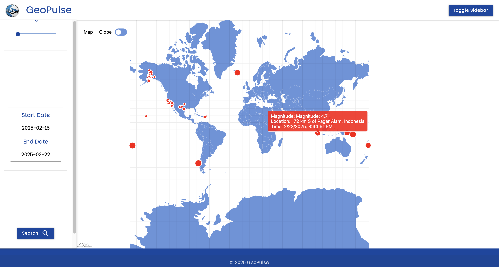

# Earthquake Visualizer
Explore earthquake data on an interactive map, with customizable settings to filter by magnitude, date, and location.

## Filter by
  - Minimum magnitude
  - Start date
  - End date

## Data Displayed
  - Visualized the location of the earthquake on a map
  - Magnitude
  - Location
  - Time
## Demo

## Access here
https://joshuac-coder.github.io/GeoPulse/
